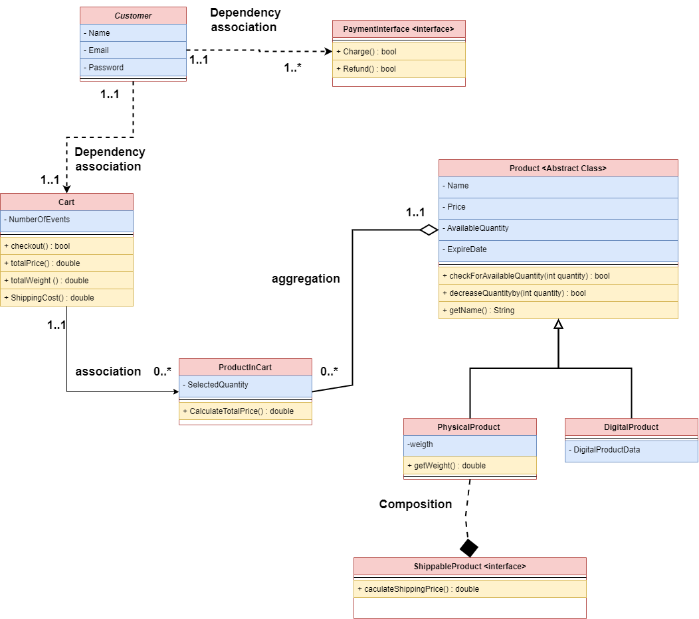

# 📐 Class Diagram & Design Overview

Welcome to the **Diagrams and Architecture Design** folder of the Fawry Rise Journey e-commerce system!

This folder provides a clear and structured view of the system's architecture through both a visual image and an editable diagram file.

---

## 📸 Preview

> This image illustrates the core components, class relationships, and interactions of the system.

---

## 📁 Files Included

### ✅ `FawryRiseJourney-EcommerceSystem.png`

* A high-level class diagram image of the system.
* Shows key classes such as `Product`, `Customer`, `Cart`, `PaymentInterface`, and their relationships.
* Use this to quickly understand how the system is designed and how modules interact.

### 📝 `FawryRiseJourney-EcommerceSystem.drawio`

* The editable source file created using [draw.io](https://draw.io).
* You can open this in the draw\.io app or online editor to customize or extend the diagram.

---

## 💡 Why Use This?

* Helps new developers and reviewers grasp the project structure fast.
* Useful for onboarding, refactoring, or proposing system changes.
* Great for documentation and academic/demo purposes.

Feel free to contribute updates or refinements to the diagrams as the project evolves!
